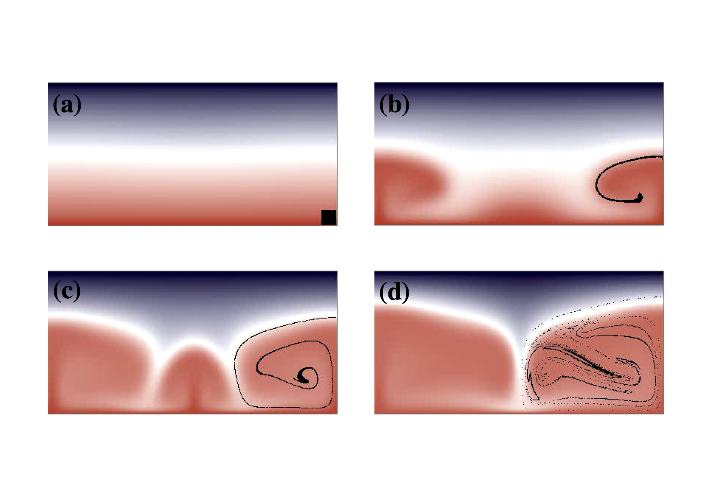
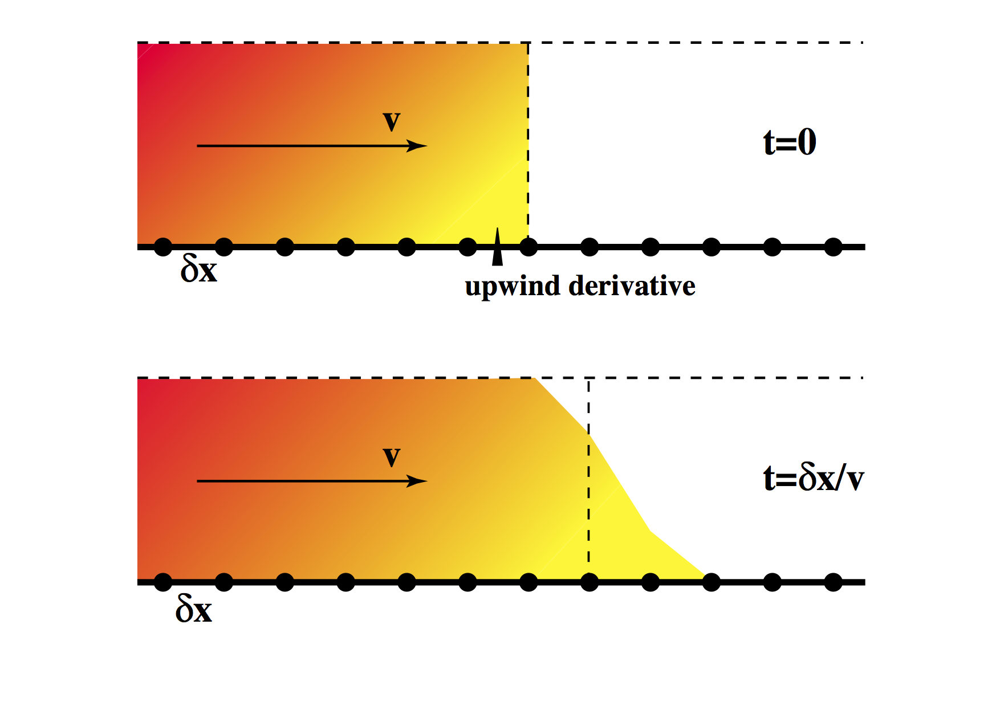

\\[
\newcommand{\dGamma}{\mathbf{d}\boldsymbol{\Gamma}}
\newcommand{\erfc}{\mbox{\rm erfc}}
\newcommand{\curly}{\sf }
\newcommand{\Red     }[1]{\textcolor[rgb]{0.7,0.0,0.0}{ #1}}
\newcommand{\Green   }[1]{\textcolor[rgb]{0.0,0.7,0.0}{ #1}}
\newcommand{\Blue    }[1]{\textcolor[rgb]{0.0,0.0,0.7}{ #1}}
\newcommand{\Emerald }[1]{\textcolor[rgb]{0.0,0.7,0.3}{ #1}}
\\]

We now move on to look at a different problem which also brings a few surprises when we attempt to find a straightforward numerical treatment. Specifically, the equations that govern transport of a quantity by a moving fluid (advection). This seems pretty straightforward as we simply have to account for a concentration being moved around by a velocity vector field. There are multiple tricks involved in doing this accurately.

## Generalizing from the Simplest Example

We have learned a number of things --- in particular

 - We have to know something about the governing equations of the system before modeling can proceed (i.e. a conceptual model, and then a mathematical model).

 - Before the equations can be solved in the computer, it is necessary to render the problem finite.

 - The discretization method chosen may not be effective for a particular problem. Numerical modeling can be an art since experience with different differential equations is often needed to avoid pitfalls.

## The Problem with Advection

Advection is a fundamental concept in fluid mechanics, get it makes the lives of fluid dynamicists much more difficult. It can be particularly problematic in numerical modeling. This is worth having in mind when we discuss different numerical methods because in application to solid Earth dynamics, advection will be a major issue with any method we choose.

---

*Advection pure and simple --- with no diffusion, fluid motion winds up initially local regions into long, convoluted tendrils*

---

As we discussed previously in dealing with approximate analytic solutions, the solution to all our advection woes is to deal with a coordinate system locked to the fluid. Unfortunately, while this approach works well in some situations -- predominantly solid mechanics and engineering applications where total deformation is generally no more than a few percent strain -- in fluids, the local coordinate system becomes quite hard to track. In the figure above, a small, square region of fluid has been tagged and is followed during the deformation induced by a simple convection roll. It is clear that a coordinate system based on initially orthogonal sets of axes rapidly becomes unrecognizably distorted.

Advection, in the absence of any diffusion terms, represents a transport of information about the state of an individual parcel of fluid which is different from the state of its neighbours. For example, it might be a dye which tells us whether a parcel of fluid started in on half of the domain or the other. We are dealing with a chaotic system in the sense that parcels of material which start abitrarily close together will wind up exponentially far apart as time progresses. Thus, the dye will become ever more stretched and filamented without ever being mixed (at least in laminar flow).

If the dye can diffuse then, the finer scales of the tendrils will in fact be mixed because they are associated with enormous spatial gradients (e.g. compare this with boundary layers). If the dye cannot diffuse then the density of information needed to characterize the system increases without limit. Numerically this is impossible to represent since at some stage, the stored problem has to be kept finite.  This can be imagined as an effective diffusion process, although it has an anisotropic and discretization dependent form.  The rule of thumb, that arises from this observation is that the _real_ diffusion coefficient must be larger than the numerical one if the method is to give a true representation of the problem.

### Numerical Example in 1D

---

*Setup for a first attempt at a numerical advection scheme on a fixed discretization. After two timesteps, the sharp front has become smoothed despite introducing no genuine diffusion*

---

Let us follow the usual strategy and consider the simplest imaginable advection equation:
\\[
    \frac{\partial \phi}{\partial t} = -v \frac{\partial \phi}{\partial x}
\\]
in which \\(v \\) is a constant velocity. Obviously we need to introduce some notation as a warm-up for solving the problem. We break up the spatial domain into a series of points separated by \\(\delta x \\) as shown above and, as we did in the earlier examples, break up time into a discrete set separated by \\(\delta t \\).
The values of \\(\phi\\) at various times and places are denoted by

\\[
    \begin{align}
        \nonumber
         _ {i-1} & \phi _ {n-1} & _ {i} & \phi _ {n-1} & _ {i+1} & \phi _ {n-1}  \newline \nonumber
         _ {i-1} & \phi _ {n}   & _ {i} & \phi _ {n}   & _ {i+1} & \phi _ {n}   \nonumber \newline \nonumber
         _ {i-1} & \phi _ {n+1} & _ {i} & \phi _ {n+1} & _ {i+1} & \phi _ {n+1}
         \nonumber
    \end{align}
\\]

where the \\(i \\) subscript is the \\(x \\) position and \\(n\\) denotes the timestep:
\\[
    \phi(x _ i,n\Delta t) = { _ {i}\phi} _ n
\\]

A simple discretization gives
\\[
\begin{split}
_ {i}\phi _ {n+1} &= \frac{\partial \phi}{\partial t} \Delta t + { _ {i}\phi _ n } \\
            & = -v \frac{ { _ {i+1}\phi _ n} - { _ {i-1}\phi _ n}}{2 \delta x} + { _ {i}\phi _ n}
\end{split}
\\]
For simplicity, we set \\(v\delta t = \delta x /2\\) and write
\\[
    { _ {i}\phi} _ {n+1} = \frac{1}{4}\left(  { _ {i+1}\phi} _ n - { _ {i-1}\phi} _ n \right)
\\]

|   |  time  | i-2 | i-1 | i | i+1 | i+2 | i+3 | \\( \int \phi dx \\) |
|:--- |:--- |:--- |:--- |:--- |:--- |:--- |:--- |:--- |
|**Centred** | t=0                 | 1 | 1      | 1     | 0     | 0      | 0     | 3   |
|            | t=\\(\delta x/2v\\) | 1 | 1      | 1.25  | 0.25  | 0      | 0     | 3.5 |
|            | t=\\(\delta x/v \\) | 1 | 0.938  | 1.438 | 0.563 | 0.0625 | 0     | 4.0 |
| **Upwind** | t=0                 | 1 | 1      | 1     | 0     | 0      | 0     | 3   |
|            | t=\\(\delta x/2v\\) | 1 | 1      | 1     | 0.5   | 0      | 0     | 3.5 |
|            | t=\\(\delta x/v \\) | 1 | 1      | 1     | 0.75  | 0.25   | 0     | 4.0 |

Table: _Hand calculation of low order advection schemes_

We compute the first few timesteps for a step function in \\(\phi\\) initially on the location \\(x_i\\) as shown in the diagram. These are written out in the first section of the table above. There are some oddities immediately visible from the table entries. The step has a large overshoot to the left, and its influence gradually propogates in the upstream direction. However, it does preserve the integral value of \\(\phi\\) on the domain (allowing for the fact that the step is advancing into the domain).

These effects can be minimized if we use "upwind differencing". This involves replacing the advection term with a non-centred difference scheme instead of the symmetrical term that we used above.
\\[
\begin{split}
_ {i}\phi _ {n+1} &= \frac{\partial \phi}{\partial t} \Delta t + { _  {i}\phi _ n} \\
            & = -v \frac{ { _ {i}\phi _ n} - { _ {i-1}\phi_n}}{\delta x} + { _ {i}\phi _ n}
\end{split}
\\]
Where we now take a difference only in the upstream direction.

The results of this advection operator are clearly superior to the centred difference version. Now the step has no influence at all in the upstream direction, and the value does not overshoot the maximum. Again, the total quantity of \\(\phi\\) is conserved.

Why does this apparently _ad hoc_ modification make such an improvement to the solution ?  We need to remember that the fluid is moving. In the time it takes to make the update at a particular spatial location, the material at that location is swept downstream. Consider where the effective location of the derivative is computed at the beginning of the timestep - by the end of the timestep the fluid has carried this point to the place where the update will occur.  This has some similarity to the implicit methods used earlier to produce stable results.

### Node/Particle Advection

Contrary to the difficulty in advecting a continuum field, discrete particle paths can be integrated very easily. For example a Runge-Kutta integration scheme can be applied to advance the old positions to the new based on the known velocity field. It is only when the information needs to be recovered back to some regular grid points that the interpolation degradation of information becomes important.

#### Courant condition

For stability, the maximum value of \\(\delta t\\) should not exceed the time taken for material to travel a distance \\(\delta x\\). This makes sense as the derivatives come from local information (between a point and its immediate neighbour) and information cannot propogate faster than \\(\delta x / \delta t \\). If the physical velocity exceeds the maximum information velocity, then the procedure must fail.

This is known as the Courant (or Courant-Friedrichs-Lewy) condition. In multidimensional applications it takes the form
\\[
    \delta t \le \frac{\delta x}{\sqrt{N} |v|}
\\]
where \\(N \\) is the number of dimensions, and a uniform spacing in all directions, \\( \delta x \\) is presumed.

The exact details of such maximum timestep restrictions for explicit methods vary from problem to problem. It is, however, important to be aware that such restrictions exist so as to be able to search them out before trouble strikes.

One of the ugliest problems from advection appears when viscoelasticity is introduced. In this case we need to track a tensor quantity (stress-rate) without diffusion or other distorting effects.  Obviously this is not easy, especially in a situation where very large deformations are being tracked elsewhere in the system - e.g. the lithosphere floating about on the mantle as it is being stressed and storing elastic stress.

### References

...
